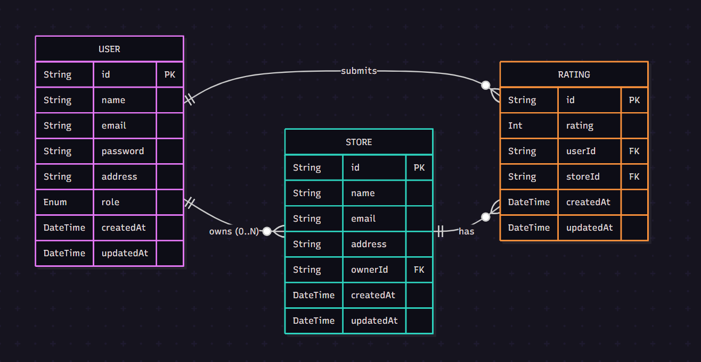

# Store Rating System

A full-stack multi-role store rating platform that allows users to rate stores, store owners to manage their stores, and administrators to oversee the entire system.

## 🎯 Overview

This application provides a comprehensive store rating system with three distinct user roles:
- **Admin**: Full system access - create stores, manage users, view analytics
- **Store Owner**: Manage assigned stores and view ratings
- **User**: Browse stores and submit ratings

## 🛠 Tech Stack

| Layer | Technologies |
|-------|-------------|
| **Backend** | Node.js, TypeScript, Express.js, PostgreSQL, Prisma, JWT, bcrypt |
| **Frontend** | Next.js (App Router), TypeScript, Tailwind CSS, Axios |
| **Storage** | LocalStorage (JWT tokens) |

## 📊 Database Schema

The system uses three main models:

**User** - Supports ADMIN, USER, STORE_OWNER roles with hashed passwords  
**Store** - Can be created with or without an owner  
**Rating** - Links users to stores (one rating per user per store)



## 📁 Project Structure

```
store-rating-system/
│
├── backend/
│   ├── prisma/
│   │   ├── migrations/              # Database migration history
│   │   ├── schema.prisma            # Database schema definition
│   │   └── seed.ts                  # Sample data seeder
│   │
│   ├── src/
│   │   ├── controllers/             # Request handlers
│   │   │   ├── authController.ts
│   │   │   ├── adminController.ts
│   │   │   ├── userController.ts
│   │   │   └── storeOwnerController.ts
│   │   │
│   │   ├── middlewares/             # Authentication & authorization
│   │   │   └── auth.ts
│   │   │
│   │   ├── routes/                  # API route definitions
│   │   │   ├── authRoutes.ts
│   │   │   ├── adminRoutes.ts
│   │   │   ├── userRoutes.ts
│   │   │   └── storeOwnerRoutes.ts
│   │   │
│   │   ├── types/                   # TypeScript interfaces
│   │   │   └── index.ts
│   │   │
│   │   ├── utils/                   # Utilities
│   │   │   ├── prisma.ts            # Prisma client instance
│   │   │   └── validation.ts        # Input validation functions
│   │   │
│   │   └── server.ts                # Express app entry point
│   │
│   ├── .env                         # Environment variables
│   ├── package.json
│   └── tsconfig.json
│
└── frontend/
    ├── src/
    │   ├── app/
    │   │   ├── layout.tsx           # Root layout with navbar
    │   │   ├── globals.css          # Global styles
    │   │   ├── page.tsx             # Home page (no navbar)
    │   │   │
    │   │   ├── (auth)/              # Auth routes (no navbar)
    │   │   │   ├── login/
    │   │   │   │   └── page.tsx
    │   │   │   └── signup/
    │   │   │       └── page.tsx
    │   │   │
    │   │   ├── stores/              # Normal user route
    │   │   │   └── page.tsx
    │   │   │
    │   │   ├── manage-store/        # Store owner route
    │   │   │   └── page.tsx
    │   │   │
    │   │   ├── admin-panel/         # Admin-only area
    │   │   │   ├── layout.tsx       # Admin route protection
    │   │   │   ├── page.tsx         # Dashboard navigation
    │   │   │   ├── add-stores/
    │   │   │   │   └── page.tsx
    │   │   │   ├── add-users/
    │   │   │   │   └── page.tsx
    │   │   │   └── dashboard/
    │   │   │       └── page.tsx
    │   │   │
    │   │   ├── change-password/
    │   │   │   └── page.tsx         # Password change (no navbar)
    │   │   │
    │   │   └── not-found.tsx
    │   │
    │   ├── components/
    │   │   ├── Navbar.tsx           # Navigation component
    │   │   ├── ProtectedRoute.tsx   # Route protection helper
    │   │   └── Loading.tsx          # Loading spinner
    │   │
    │   ├── services/                # API integration layer
    │   │   ├── api.ts               # Axios instance configuration
    │   │   ├── auth.ts              # Auth endpoints
    │   │   ├── admin.ts             # Admin endpoints
    │   │   ├── storeOwner.ts        # Store owner endpoints
    │   │   ├── users.ts             # User endpoints
    │   │   └── helpers.ts           # Utility functions
    │   │
    │   └── types/
    │       └── index.ts             # TypeScript type definitions
    │
    ├── package.json
    ├── next.config.js
    ├── tailwind.config.js
    ├── postcss.config.js
    ├── tsconfig.json
    └── .env.local

```

## ✨ Key Features

### For All Users
- Secure authentication with JWT
- Password change functionality
- Role-based access control

### For Regular Users
- Browse all available stores
- Submit ratings for stores
- View store details and average ratings

### For Store Owners
- View dashboard for owned stores
- Monitor ratings and feedback
- Manage store information

### For Administrators
- Create and manage stores
- Create users with specific roles
- Assign stores to owners
- View comprehensive analytics
- Full system oversight

## 🚀 Getting Started

See [HOW-TO-USE.md](./HOW-TO-USE.md) for setup instructions.

---

Built with ❤️ using Next.js, Express.js, and PostgreSQL